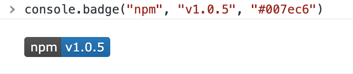

# **c**on**s**ole.**b**ad**g**e()

Print badges in your console.

[](https://npm.im/csbg) [](https://npm.im/csbg)



## Install

    npm i csbg

## Usage

Use `printBadge()` function to print a shields.io style badge in your console.

```js
import { printBadge } from "csbg"

printBadge("npm", "v1.0.0", "#007ec6")
```

Or you can install `.badge()` method on `console`.

```js
import "csbg/install"

console.badge("npm", "v1.0.0")
```

## License

MIT &copy; [Doma](https://github.com/SevenOutman)
